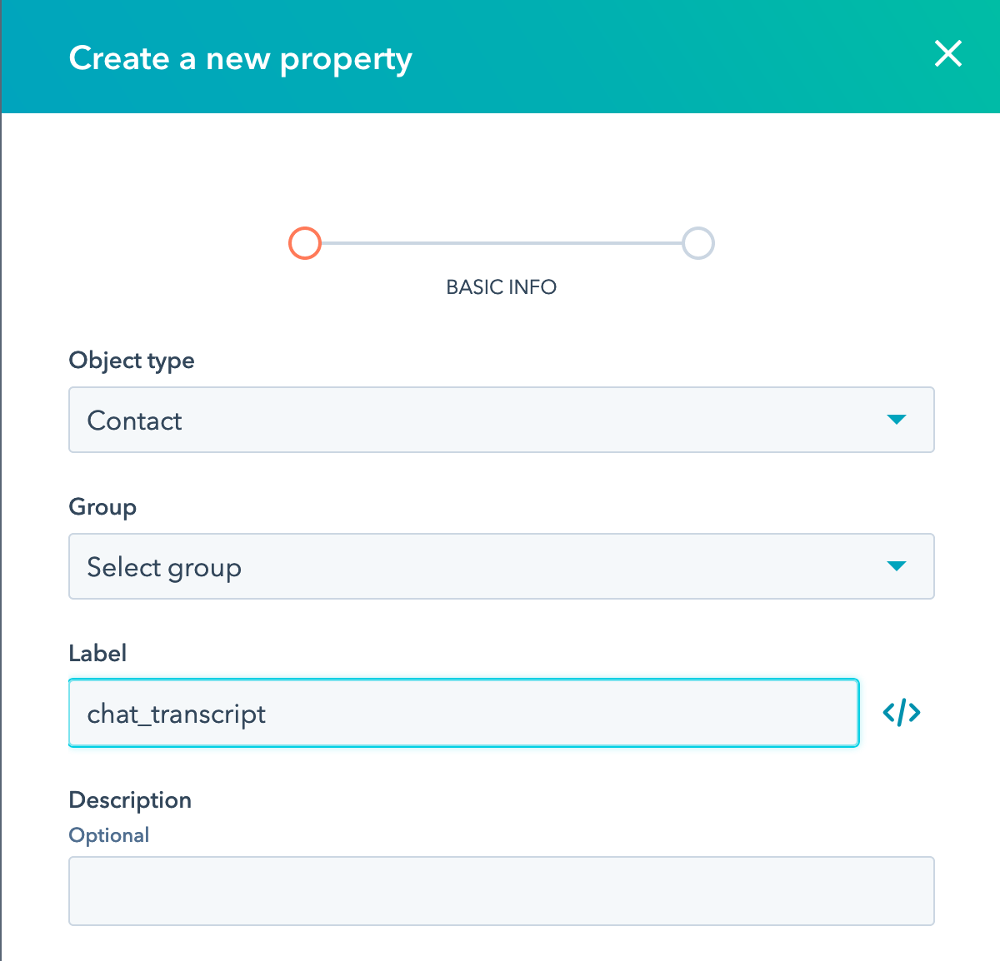

# Save a Chat Widget Transcript to a Hubspot CRM Contact Using Webhooks

This tutorial will explore how to make a chat widget that connects to the HubSpot CRM to (1) create or update a HubSpot CRM Contact with the user’s info, and (2) save chat logs in HubSpot. We’ll use the versatile [Stream Chat](https://getstream.io/chat/) client and its webhooks to accomplish this. The steps provided here will help you learn how to leverage webhooks to interact with your HubSpot CRM, based on any events within your chat widget. 

### Overview:

- Open a free Stream account and configure an API key
- Configure a HubSpot CRM account to connect to the HubSpot API
- Build a backend that
   1. Creates or updates the user’s info to a HubSpot CRM Contact
   2. Starts a chat widget using Stream
   3. Opens a private chat channel for the user and a support representative
   4. Sends data back to the frontend for the user to join the chat channel
   5. Logs all messages in the chat channel to the HubSpot CRM using webhooks

The code for this app can be found in the [Git Repo here](https://github.com/psylinse/stream-hubspot-chat-transcript)

### Read this tutorial if you want to...

- Learn how to use webhooks
- Build a support/sales style chat widget
- Create HubSpot contacts and message logs based on your chat widget
- Create HubSpot and Stream accounts and get API Keys
- Set up a frontend/backend Stream Chat app
- Create a Chat Widget that automatically saves the chat log in HubSpot CRM (using Stream Chat's webhook)
- Set up a private, Frontend/Backend Stream Chat

These topics will be covered using Express JS and React, but the methodologies can be ported to most languages.

### What's not covered

- This tutorial focuses on the mechanics of setting up the backend of a chat widget to connect to and update HubSpot. Specifics on creating the React frontend will not be the priority.
- The GitHub repo for this project includes a fully functional registration form and frontend Stream chat, but not every aspect will be covered in depth.

## Step 1: Account set up

To get up and running, perform the following steps:

* Clone the [git repo](https://github.com/isaidspaghetti/stream-hubspot-chat-transcript)
* Set up a free Stream Account and configure an API Key and Secret
* Set up HubSpot and configure your HubSpot API Key
* Set `chat_transcript` as a custom contact property field in HubSpot
* Add your unique keys to a `.env` file

### Set-up your Stream account

1. Sign up for a [Stream Trial](https://getstream.io/get_started).

1. Then to generate a Stream API Key and API Secret, navigate to your [Stream.io Dashboard](https://getstream.io/dashboard/). 


2. Then click on "Create App", and complete the form like in the following screenshot.


3. Give your app a name, select "Development" and click "Submit". 
 


4. Stream will generate a Key and Secret for your app. You need to copy these into your `.env` file.
 


* Set up a free HubSpot Account and configure an API Key there, as well

### Set-up your HubSpot account

1. Create your account at [HubSpot](https://app.hubspot.com/signup/crm/step/user-info?hubs_signup-cta=getstarted-crm&hubs_signup-url=www.hubspot.com%2Fproducts%2Fget-started) and complete the registration form.

2. Once you are logged into the `HubSpot Dashboard,` go to Settings in the upper-right corner


3. Navigate to Integrations > API Key, and create a key. If you're a robot, stop here. You've gone too far...


4. Copy the Hubspot API key and paste it in the `.env`

<script src="https://gist.github.com/isaidspaghetti/78ab29744d5c3d93d735a1a81d1b83e0.js"></script>

Your HubSpot account can now be accessed through this API key.

### Create a custom HubSpot property for a chat transcript

To save the chat transcript, we will use a custom property field in HubSpot. Here's how to add a custom property to your HubSpot CRM:

1. Navigate to your contacts:


2. Click the 'Actions' drop down menu, then 'Edit Properties':


3. Click the 'Create Property' button and add whatever type of custom fields you'd like to use.



### Set your local environment variables

1. Copy the file `.env.example` to `.env`. 

1. Add your API keys and secret to `.env`.

```text
//backend/.env
NODE_ENV=development
PORT=8080

STREAM_API_KEY= your stream API key here
STREAM_API_SECRET= your stream API secret here
HUBSPOT_API_KEY=your HubSpot API key here
```

## Step 2: Webhook Setup

### What are webhooks?

If you’re new to [webhooks](https://zapier.com/blog/what-are-webhooks/), here’s a quick explanation of how they work. Webhooks are like push notifications between apps. Before webhooks, a backend service had to poll another to react to updates or changes. The concept of pushing events came along and the responsibility is inverted. Instead of polling, the consuming service simply waits to be notified of an event. A webhook is similar to a push notification that gets sent to your phone except for your backend services. Stream’s webhooks alert your app about anything that happens in any Stream Chat. This app uses Stream’s webhooks to push new messages to our backend, and our backend can react to those messages. 

// todo@taylor: I like this idea, but it's not quite right, let's talk about this
A webhook might look like this:


Where the first portion is the specific URL which will receive a POST from the webhook, and the information after the `?` is the payload

### Setting up a Stream webhook

Stream offers a lot of depth and versatility in its webhooks. To start using them, let's first tell the Stream where to send webhook events. Stream’s webhooks require a publicly routable URL to communicate with. This project runs off a `localhost`, so we need to somehow make our localhost address accessible. We’ll use [ngrok](https://gist.github.com/wosephjeber/aa174fb851dfe87e644e) to create a secure, temporarily public address for our backend. If you already have a public URL running, you can skip the `ngrok` steps and just set up an endpoint URL there.

#### Quick detour: How ngrok works

A very brief overview of how the ngrok app works:

1. ngrok sets up a random, public URL on its servers. This URL can receive HTTP requests (eg: webhooks).
2. ngrok opens an SSH connection with your local machine.
3. Requests to the ngrok public URL get proxied through an SSH tunnel to your local machine.
4. Run your backend as you normally would, through any port (eg: localhost:8080).
5. ngrok receives the SSH request, translates it back to a local HTTP request, and sends it to your app a the specified port.
6. The local app runs as it normally would, sending a response to port 8080.
7. ngrok receives responses from your app, and sends the responses back to the ngrok server via SSH

### ngrok setup

1. [Register for a free ngrok account](https://dashboard.ngrok.com/get-started/setup) and download the software.
   *if you prefer to use Homebrew to install ngrok, use the following terminal command: `Brew cask install ngrok`.
2. Once installed, connect your account using the authtoken provided by ngrok at the [same link as above](https://dashboard.ngrok.com/get-started/setup). Just run `ngrok authtoken your_token_goes_here` in the terminal. 
3. To start ngrok, use the terminal command: `ngrok http 8080`: which tells ngrok to serve publicly whatever you are serving locally at http://localhost:8080.   
4. The terminal opens the ngrok app (screenshot below) and shows the public URLs. 


Now, whatever is hosted at `localhost:8080` can receive HTTP requests at this URL. (The URL boxed in red is the publicly available URL).

### Create a backend webhook handler

The backend of our app needs a handler for webhooks. This is initialized on lines 10 and 20 of `api.js`:

```javascript
//backend/api.js:10
const webHookRouter = require('./routes/index')
```
And

```javascript
//backend/api.js:20
api.use('/webhooks', webHookRouter)
```

The code snippets above tell Express to use the file `backend/routes/index.js` anytime an HTTP request is made to the route `/webhooks`. Next, we need to let Stream know about this webhook URL.

### Configure your public webhook URL in Stream

Use the following steps to register your ngrok (or other public URL) with the Stream API:

1. Navigate to [getstream.io](https://getstream.io/) and click the "Dashboard" button on the upper right:


2. Once in the dashboard, click your app name:


3. Next, from the navbar select the `chat` dropdown and select `Chat Overview`


4. Scroll down to the `Chat Events` box. Select the following options: `Webhook: active`, `Disable Auth Checks`, and `Disable Permissions Checks`. (Note that these options are important to consider using if using this app in a production environment). Then, add your public URL and `/webhooks` to the webhook URL textbox. Save your settings.


The Stream API will now send a `POST` to that URL anytime an event takes place in your Stream App, with details about the event. The next step is to accept that webhook in our app's backend.

## Registration endpoint

Before we can handle a user's chat event, we need to register them in both Stream and HubSpot.

### Initialization 

The backend file `backend/routes/index.js` is the core of this app. Let's take a peek at how this file is initiated:

```javascript
//backend/routes/index.js:1
const express = require('express');
const router = express.Router();
const { StreamChat } = require('stream-chat');
const { default: axios } = require('axios');

const apiKey = process.env.STREAM_API_KEY;
const apiSecret = process.env.STREAM_API_SECRET;
const hubspotKey = process.env.HUBSPOT_API_KEY
```

The `stream-chat` library is the all-in-one chat creator, which handles all the heavy lifting of for our chat portion of the app. `axios` will be used to perform external HTTP requests to HubSpot. 

### User registration: starting a chat

`index.js` contains two endpoints: one for registering a user, and one for receiving webhooks. The registration endpoint is responsible for:

1. Accepting the user's frontend form input
2. Creating a HubSpot customer entry
3. Initializing a Stream chat client
4. Registering the user and support admin with Stream
5. Creating a Stream chat channel

Here's the primary registration endpoint, which we will be breaking down step by step.

```javascript
//backend/routes/index.js:39
router.post('/registrations', async (req, res, next) => {
  try {
    const firstName = req.body.firstName.replace(/\s/g, '_');
    const lastName = req.body.lastName.replace(/\s/g, '_');
    const email = req.body.email.toLowerCase()
    const hubspotCustomerId = await createHubspotContact(firstName, lastName, email)

    const client = new StreamChat.StreamChat(apiKey, apiSecret);

    [customer, supporter] = createUsers(firstName, lastName)

    await client.upsertUsers([
      customer,
      supporter
    ]);

    const channel = client.channel('messaging', hubspotCustomerId, {
      members: [customer.id, supporter.id],
    });

    const customerToken = client.createToken(customer.id);

    res.status(200).json({
      customerId: customer.id,
      customerToken,
      channelId: channel.id,
      apiKey,
    });

  } catch (err) {
    console.error(err);
    res.status(500).json({ error: err.message });
  }
});
```

### Registration: Create a contact in the HubSpot API

First, the name inputs are normalized by replacing spaces with '_', and the email is converted to lower case. These values will be stored in HubSpot, so having uniform styling makes it easier to call them when needed. Next, a separate method, `createHubspotContact()` is called to connect to the HubSpot API and create a new contact in the CRM.

```javascript
//backend/routes/index.js:11
async function createHubspotContact(firstName, lastName, email) {

  let hubspotContact = await Axios.post(`https://api.hubapi.com/crm/v3/objects/contacts?hapikey=${hubspotKey}`,
    {
      properties: {
        'firstname': firstName,
        'lastname': lastName,
        'email': email,
      }
    })
  return hubspotContact.data.id
}
```

Axios is used to `POST` the frontend user's inputs to HubSpot's endpoint. The secret `hubspotKey` is passed to let HubSpot know (1) which account to add the contact to, and (2) that the request is legitimate. The properties passed can match any HubSpot contact property, including custom properties. This method returns HubSpot's unique contact id, which will be helpful later in our webhook. 

Take note that the API will check for an existing customer with the email address submitted, and will not overwrite existing users.

### Registration: Create a client and users

Once the contact is created, we instantiate a Stream client bypassing our unique Stream API Key and Stream Secret. 

```javascript
//backend/routes/index.js:47
const client = new StreamChat(apiKey, apiSecret);
```

To allow our chat users to join, they will first need to be registered with Stream. For this app, only the frontend user and a customer support user are required.

The `createUsers` method creates the users in Stream, with optional properties to control each user's permissions. The method accepts the user inputs to create the `customer` object and creates a generic `supporter` user to represent a technical or sales representative on the other end of the chat. 

```javascript
//backend/routes/index.js:24
function createUsers(firstName, lastName) {
  const customer = {
    id: `${firstName}-${lastName}`.toLowerCase(),
    name: firstName,
    role: 'user',
  };

  const supporter = {
    id: 'admin-id',
    name: 'Support Admin',
    role: 'admin'
  }
  return [customer, supporter]
}
```

There are other ways to create users in Stream, but this technique illustrates some of Stream's flexibility in doing so. User objects only require an `id`, but Stream offers a handful of built-in [property options](https://getstream.io/chat/docs/init_and_users/?language=js), and accepts any custom property you want to make. 

Back in the registration handler, the user objects are passed to `upsertUsers`, which registers the users with the client.

```javascript
//backend/routes/index.js:51
await client.upsertUsers([
      customer,
      supporter
    ]);
```

### Registration: Create a channel

Next, the `/registrations` handler starts a Stream channel. Stream's `channel()` method accepts parameters: `('type', 'id', {channel-data})`. Our app uses: 

```javascript
//backend/routes/index.js:55
const channel = client.channel('messaging', hubspotCustomerId, {
      members: [customer.id, supporter.id],
    });
```

There are several different [channel types](https://getstream.io/chat/docs/channel_features/?language=js), which are customizable. For this session, we'll just use `'messaging'`. The `id` field is important, as our webhook will use it later. The third argument commands that only users with Stream id's matching `customer.id` or `supporter.id` will be allowed to enter this channel.

### Registration: Respond to the frontend

Last, but not least: we create a `customerToken` and respond to the frontend of the application with all the data needed to join the chat we have created. 

```javascript
//backend/routes/index.js:60
const customerToken = client.createToken(customer.id);
```

The frontend then follows a similar process as the backend but is out of the scope of this post. To learn more check out [this example](https://github.com/nparsons08/stream-hubspot-contacts).

## Webhook handler

The `backend/routes/index.js` file also contains the `webhook` endpoint. Here is the process flow of this endpoint: 

1. Receive a request from the Stream webhook service.
2. If the webhook is initiated by a new message event (`new.message`), continue, otherwise do nothing.
3. Store the message body and channel id from the webhook request.
4. Use `axios` to retrieve any existing chat transcript from the HubSpot.
5. Save a local version of the chat transcript, and append the new message
6. Use `axios` to update the custom `chat_transcript` HubSpot contact property

And here's the code:

```javascript
//backend/routes/index.js:75
router.post('/webhooks', async (req, res, next) => {
  if (req.body.type === 'message.new') {
    try {
      var newMessage = req.body.message
      var hubspotCustomerId = req.body.channel_id

      await Axios
        .get(`https://api.hubapi.com/crm/v3/objects/contacts/${hubspotCustomerId}`, {
          params: {
            properties: 'chat_transcript',
            archived: false,
            hapikey: hubspotKey,
          }
        })

        .then(async (res) => {
          let localTranscript = res.data.properties.chat_transcript
          let updatedTranscript = `${localTranscript}\n FROM: ${newMessage.user.id}\n SENT AT: ${newMessage.created_at}\n MESSAGE: ${newMessage.text}`

          await Axios
            .patch(`https://api.hubapi.com/crm/v3/objects/contacts/${hubspotCustomerId}?hapikey=${hubspotKey}`, {
              properties: {
                'chat_transcript': updatedTranscript,
              }
            })
            .catch((e) => console.log('Unable to update chat transcript', e))
        }
        )
        .catch((e) => console.log('Customer not found in HubSpot CRM: ', e))
    }

    catch (err) {
      console.log('Webhook did not respond properly', err)
      res.status(200).end()
    }
  }

  res.status(200).end()
})
```

Let's break down the handler above. Stream's webhook pings this handler anytime an event occurs in our app. We only want to update `chat_transcript` when a new message is sent, so we add an `if` `then` to execute this function only when `message.new` is the webhook initiator. Stream offers over twenty [webhook initiators](https://getstream.io/chat/docs/webhook_events/?language=js). 

HubSpot's API has plenty of [useful endpoints](https://developers.hubspot.com/docs/api/crm/contacts) as well. We just need to call two of them. The first call is to retrieve any existing chat transcript saved in HubSpot. We specify the exact contact we want to check by including the `hubspotCustomerId` and ask for just their chat transcript using `chat_transcript` as a parameter. Note that custom contact properties in HubSpot are called using the Label Name shown in the HubSpot property editor window (see below). If you included spaces or dashes in your contact property, use an underscore when referencing it in your request body. 


The chat transcript can be customized with whatever properties are useful for your application. The string literal used in this example includes the `user.id`, `created_at` date, and message `text`, each of which is included in the Stream webhook request body. To see the available properties provided by the webhook, use `console.log(req.body)`.

The second `axios` request is sent to the HubSpot API's a contact update URL. The request specifies the property to be updated and what to update it with. Multiple properties can be updated at once if desired. 

Line 108 is not necessary for the code to run, but ensures that our connection with the HubSpot API will be closed when our task is done. Some APIs might flag your app for repeatedly leaving requests open.

## Closing thoughts

What may sound like a daunting task can be done quite artfully when using the right tools for the job. In this case, the right tools are a chat app with webhooks (Stream), and tactful use of HubSpot API endpoints. Hopefully, this post has inspired you creatively and equipped you with skills to make your app tasks easier.
